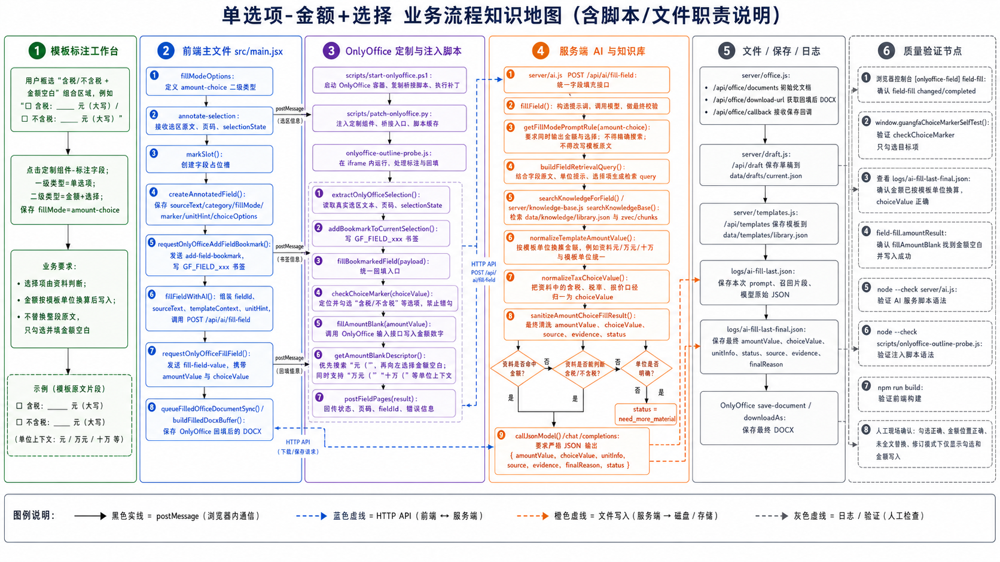

# 单选项-金额+选择 业务流程知识地图

流程图：

## 1. 路由与业务定义

| 项 | 内容 |
| --- | --- |
| 一级类别 | 单选项 |
| 二级类别 | 金额+选择 |
| 代码值 | `fillMode=amount-choice` |
| 执行原则 | 同一选区既写金额又勾选选项。AI 必须同时返回 `amountValue` 和 `choiceValue`。 |
| 金额规则 | `amountValue` 按模板单位换算为纯数字。 |
| 选择规则 | `choiceValue` 只输出模板候选项，如“含税”或“不含税”。 |

## 2. 泳道一：模板标注工作台

| 步骤 | 用户动作或业务判断 | 责任说明 |
| --- | --- | --- |
| 1 | 框选金额空白和含税候选项完整区域 | 例如 `最高限价： 元（□含税 □不含税）`。 |
| 2 | 点击“标注字段” | 采集完整复合选区。 |
| 3 | 选择一级“单选项”、二级“金额+选择” | 保存 `fillMode=amount-choice`。 |
| 4 | 不添加输入点 | 金额空白和候选项都在选区内，由桥接脚本定位写入。 |

## 3. 泳道二：前端主文件 `src/main.jsx`

| 节点 | 代码/接口 | 中文职责说明 |
| --- | --- | --- |
| 类型定义 | `choiceFillModeOptions` | 包含 `amount-choice`。 |
| 选区接收 | `annotate-selection` 监听 | 接收金额空白、候选项、页码和选区状态。 |
| 字段创建 | `createAnnotatedField()` | 保存 `sourceText`、`fillMode=amount-choice`、字段书签。 |
| 字段书签 | `requestOnlyOfficeAddFieldBookmark()` | 写入 `GF_FIELD_xxx`。 |
| AI 调用 | `fillFieldWithAI()` | 调 `/api/ai/fill-field` 获取 `amountValue` 和 `choiceValue`。 |
| 选择值获取 | `getFieldChoiceValue()` | 在 `amount-choice` 下优先使用 `choiceValue`。 |
| 回写 | `requestOnlyOfficeFillField()` | 发送 `value`、`amountValue`、`choiceValue`、`fillMode=amount-choice`。 |

## 4. 泳道三：OnlyOffice 定制与注入脚本

| 节点 | 脚本/消息 | 中文职责说明 |
| --- | --- | --- |
| 部署 | `scripts/start-onlyoffice.ps1` | 部署 OnlyOffice 和桥接脚本。 |
| 注入 | `scripts/patch-onlyoffice.py` | 注入标注入口并刷新缓存。 |
| 读取选区 | `extractOnlyOfficeSelection()` | 读取金额+选择复合选区。 |
| 写书签 | `addBookmarkToCurrentSelection()` | 固化复合选区为 `GF_FIELD_xxx`。 |
| 回写入口 | `fillBookmarkedField()` | 先执行选择勾选，再执行金额空白写入。 |
| 选择勾选 | `checkChoiceMarker()` | 根据 `choiceValue` 勾选含税/不含税。 |
| 金额描述 | `getAmountBlankDescriptor()` | 从选区识别金额空白长度、前缀和单位后缀，支持 `元（`、`万元（`、`十万（`。 |
| 金额写入 | `replaceBlankBeforeSelection()`、`replaceBlankAfterSelection()` | 在单位左侧或标签右侧选中空白并输入 `amountValue`。 |

## 5. 泳道四：服务端 AI 与知识库

| 节点 | 文件/函数 | 中文职责说明 |
| --- | --- | --- |
| AI 接口 | `POST /api/ai/fill-field` | 金额+选择字段接口。 |
| 主入口 | `server/ai.js` / `fillField()` | 构造复合提示词，把模板金额单位写入规则。 |
| 知识库 | `server/knowledge-base.js` / `searchKnowledgeBase()` | 检索金额和含税状态依据。 |
| 复合规则 | `getFillModePromptRule("amount-choice")` | 要求同时判断金额和候选项。 |
| 金额换算 | `normalizeTemplateAmountValue()` | 按模板单位换算金额纯数字。 |
| 含税归一 | `normalizeTaxChoiceValue()` | 将模型输出规整为“含税”或“不含税”。 |
| 结果守卫 | `sanitizeAmountChoiceFillResult()` | 金额和选择任一缺失，或证据显示资料不足时，不写入。 |
| 单位倍率 | `getAmountUnitMultiplier()` | 支持元、万、十万、亿等倍率转换。 |

## 6. 关键条件分支

| 条件 | 是 | 否 |
| --- | --- | --- |
| 金额和含税状态是否都有资料依据 | 返回 `amountValue` 和 `choiceValue`。 | 返回需补充资料，不做半套写入。 |
| 模板单位是否可识别 | 金额换算成模板单位纯数字。 | 保留资料金额单位或返回需补充资料。 |
| 选择项是否匹配 | `checkChoiceMarker()` 勾选目标。 | 返回未匹配选项错误，金额不继续写。 |
| 金额空白是否可定位 | `fillAmountBlank()` 写入金额。 | 返回 `amount-blank-descriptor-missing` 或定位失败。 |

## 7. 泳道五：文件、保存、日志

| 节点 | 文件/接口 | 中文职责说明 |
| --- | --- | --- |
| Office 文档 | `server/office.js` / `/api/office/documents` | 初始化 OnlyOffice 编辑。 |
| 下载 | `/api/office/download-url` | 下载现场 DOCX。 |
| 回调 | `/api/office/callback/:id` | 保存 OnlyOffice 修改结果。 |
| 草稿 | `server/draft.js` / `data/drafts/current.json` | 保存金额和选择结果。 |
| 模板 | `server/templates.js` / `data/templates/library.json` | 保存复合字段定义。 |
| 原始日志 | `logs/ai-fill-last.json` | 查看模型返回的金额和含税状态。 |
| 最终日志 | `logs/ai-fill-last-final.json` | 查看 `amountValue`、`choiceValue`、`finalReason`。 |

## 8. 泳道六：质量验证节点

| 验证项 | 命令或检查点 | 验证内容 |
| --- | --- | --- |
| 构建 | `npm run build` | 前端构建。 |
| AI 语法 | `node --check server/ai.js` | 金额+选择提示词和守卫语法。 |
| 桥接语法 | `node --check scripts/onlyoffice-outline-probe.js` | 勾选和金额空白写入脚本语法。 |
| 内置自测 | `window.guangfaChoiceMarkerSelfTest()` | 验证不含税匹配，以及 `元（`、`万元（`、`十万（` 金额空白识别。 |
| 现场消息 | `field-fill.amountResult` | 确认不是“勾选对了但金额未写入”。 |
| 日志 | `logs/ai-fill-last-final.json` | 核对单位换算后的 `amountValue`。 |

## 9. 当前注意点

- 这个分支不是“填数字再全文搜索选项”；金额写入由桥接脚本根据选区空白和单位定位。
- 金额和选择必须同时具备资料依据，不能半写。
