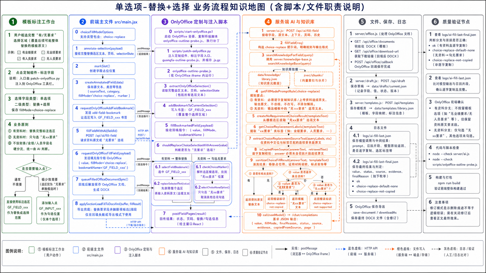

# 单选项-替换+选择 业务流程知识地图

流程图：

## 1. 路由与业务定义

| 项 | 内容 |
| --- | --- |
| 一级类别 | 单选项 |
| 二级类别 | 替换+选择 |
| 代码值 | `fillMode=choice-replace` |
| 有资料分支 | AI 只确定复制范围，`value` 必须逐字复制知识库或上传资料连续原文，并替换整个标注选区。 |
| 无资料分支 | 只勾选模板中的“无xx要求”选项，不替换原文。 |
| 适用范围 | 财务要求、业绩要求、人员要求、资质要求等通用要求类字段。 |

## 2. 泳道一：模板标注工作台

| 步骤 | 用户动作或业务判断 | 责任说明 |
| --- | --- | --- |
| 1 | 框选完整“有/无要求”选择区域 | 标注选区必须覆盖后续要整体替换的模板原文。 |
| 2 | 点击“标注字段” | 采集完整选区。 |
| 3 | 选择一级“单选项”、二级“替换+选择” | 保存 `fillMode=choice-replace`。 |
| 4 | 不按字段名分流 | 用户已选二级逻辑，后续不再靠“财务/业绩/人员”语义硬分流。 |

## 3. 泳道二：前端主文件 `src/main.jsx`

| 节点 | 代码/接口 | 中文职责说明 |
| --- | --- | --- |
| 类型定义 | `choiceFillModeOptions` | 包含 `choice-replace`。 |
| 选区接收 | `annotate-selection` 监听 | 接收完整替换选区和页码。 |
| 字段创建 | `createAnnotatedField()` | 保存 `sourceText`、`fillMode=choice-replace`、书签信息。 |
| 字段书签 | `requestOnlyOfficeAddFieldBookmark()` | 将完整选区写为 `GF_FIELD_xxx`。 |
| AI 调用 | `fillFieldWithAI()` | 调 `/api/ai/fill-field`，请求有资料原文或无要求选项。 |
| 回写 | `requestOnlyOfficeFillField()` | 发送 `value`、`fillMode=choice-replace`、书签名。 |
| 兜底导出 | `applySectionLeadFillToDocxXml()` | 导出兜底时用于要求段落替换，并删除后续模板选项段落。 |

## 4. 泳道三：OnlyOffice 定制与注入脚本

| 节点 | 脚本/消息 | 中文职责说明 |
| --- | --- | --- |
| 部署 | `scripts/start-onlyoffice.ps1` | 部署 OnlyOffice 和桥接脚本。 |
| 注入 | `scripts/patch-onlyoffice.py` | 注入定制组件和标注按钮。 |
| 读取选区 | `extractOnlyOfficeSelection()` | 读取完整替换选区和页码。 |
| 写书签 | `addBookmarkToCurrentSelection()` | 把完整标注选区固化为 `GF_FIELD_xxx`。 |
| 分流判断 | `shouldReplaceChoiceSelectionWithAnswer()` | `value` 不是“无xx要求”时替换；是“无xx要求”时只勾选。 |
| 有资料替换 | `selectFieldBookmark()` → `replaceSelectedText()` | 选择 `GF_FIELD_xxx`，先删除整个选区，再输入资料原文。 |
| 无资料勾选 | `checkChoiceMarker()` | 解析候选项并只勾选“无xx要求”。 |

## 5. 泳道四：服务端 AI 与知识库

| 节点 | 文件/函数 | 中文职责说明 |
| --- | --- | --- |
| AI 接口 | `POST /api/ai/fill-field` | 替换+选择字段接口。 |
| 主入口 | `server/api/routes/ai.routes.js` -> `server/ai/fill.js` / `fillField()` | 构造替换+选择提示词，召回资料。 |
| 知识库 | `server/knowledge-base.js` / `searchKnowledgeBase()` | 检索要求类资料。 |
| 分支规则 | `getFillModePromptRule("choice-replace")` | 有资料时逐字复制连续原文；无资料时输出模板“无xx要求”选项文本。 |
| 无资料结果 | `createNoRequirementChoiceResult()` | 从模板选区提取“无xx要求”并返回。 |
| 标签抽取 | `getChoiceReplacementLabels()` | 从字段上下文提取“xx要求”标签。 |
| 段落抽取 | `extractChoiceReplacementSourceText()`、`extractRequirementSectionByLabel()` | 当模型返回值不够准时，尝试从召回资料中按标签抽取连续要求段。 |
| 逐字守卫 | `isCopiedFromSource()` | 有资料分支必须能在知识库或上传资料中逐字定位。 |
| 选择守卫 | `sanitizeChoiceFillResult()` | 防止模板占位和无依据选择写入。 |

## 6. 关键条件分支

| 条件 | 是 | 否 |
| --- | --- | --- |
| 是否有相关资料 | 返回资料连续原文，进入替换分支。 | 返回“无xx要求”选项，进入勾选分支。 |
| 模型返回是否逐字来自资料 | 允许写入。 | 返回需补充资料，`finalReason=choice-replace-not-copied`。 |
| `value` 是否为“无xx要求” | `checkChoiceMarker()` 只勾选。 | `replaceSelectedText()` 替换整个标注选区。 |
| 替换时字段书签是否存在 | 删除原选区并输入资料原文。 | 返回“字段书签不存在，请重新标注并保存模板”。 |

## 7. 泳道五：文件、保存、日志

| 节点 | 文件/接口 | 中文职责说明 |
| --- | --- | --- |
| Office 文档 | `server/office.js` / `/api/office/documents` | 初始化 OnlyOffice 编辑。 |
| 下载 | `/api/office/download-url` | 下载现场 DOCX。 |
| 回调 | `/api/office/callback/:id` | 保存 OnlyOffice 修改结果。 |
| 草稿 | `server/draft.js` / `data/drafts/current.json` | 保存字段和填充结果。 |
| 模板 | `server/api/routes/templates.routes.js` -> `server/template-db.js` / `data/templates/library.json` | 保存替换+选择字段定义。 |
| 原始日志 | `logs/ai-fill-last.json` | 查看召回片段和模型原始返回。 |
| 最终日志 | `logs/ai-fill-last-final.json` | 查看 `finalReason`：`ok`、`choice-replace-default-none`、`choice-replace-not-copied`。 |

## 8. 泳道六：质量验证节点

| 验证项 | 命令或检查点 | 验证内容 |
| --- | --- | --- |
| 构建 | `npm run build` | 前端构建。 |
| AI 语法 | `node --check server/api/routes/ai.routes.js` | 替换+选择提示词和守卫语法。 |
| 桥接语法 | `node --check scripts/onlyoffice-outline-probe.js` | 替换选区和勾选脚本语法。 |
| 逐字复制 | `logs/ai-fill-last.json` + `logs/ai-fill-last-final.json` | 有资料分支必须从召回片段逐字复制。 |
| 现场结果 | OnlyOffice 文档 | 有资料分支不能残留“无业绩要求/无人员要求”等模板选项；无资料分支只勾无要求。 |

## 9. 当前注意点

- 这个分支最容易错在“只替换有选项”或“没有删除整个标注选区”；正确逻辑是有资料时替换完整用户选区。
- 修订模式显示删除痕迹不代表逻辑错误；需要看关闭修订后的正文结果和书签回写路径。
