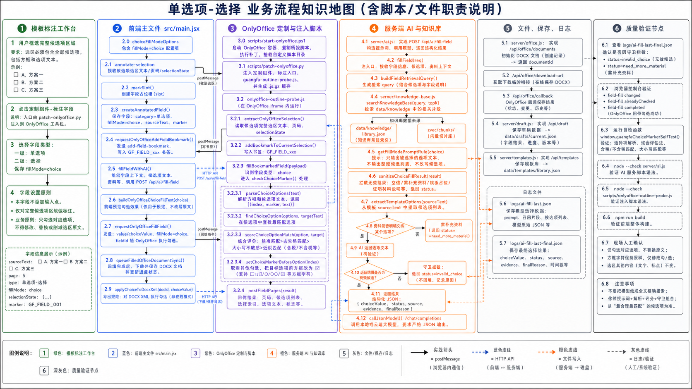

# 单选项-选择 业务流程知识地图

流程图：

## 1. 路由与业务定义

| 项 | 内容 |
| --- | --- |
| 一级类别 | 单选项 |
| 二级类别 | 选择 |
| 代码值 | `fillMode=choice` |
| 执行原则 | 只勾选对应选项，不修改选区原文。 |
| 适用场景 | 模板选区已经列出候选项，如 `□方式一 □方式二`、`○接受 ○不接受`。 |

## 2. 泳道一：模板标注工作台

| 步骤 | 用户动作或业务判断 | 责任说明 |
| --- | --- | --- |
| 1 | 框选完整候选项区域 | 选区应包含方框和候选项文本。 |
| 2 | 点击“标注字段” | 采集候选项选区。 |
| 3 | 选择一级“单选项”、二级“选择” | 保存 `fillMode=choice`。 |
| 4 | 不添加输入点 | 纯选择字段用选区内方框勾选，不写输入点。 |

## 3. 泳道二：前端主文件 `src/main.jsx`

| 节点 | 代码/接口 | 中文职责说明 |
| --- | --- | --- |
| 类型定义 | `choiceFillModeOptions` | 单选项二级类型包含 `choice`、`choice-replace`、`amount-choice`。 |
| 接收选区 | `annotate-selection` 监听 | 接收候选项文本、页码和选区状态。 |
| 字段创建 | `createAnnotatedField()` | 保存 `category=单选项`、`fillMode=choice`。 |
| 字段书签 | `requestOnlyOfficeAddFieldBookmark()` | 保存候选项选区为 `GF_FIELD_xxx`。 |
| AI 调用 | `fillFieldWithAI()` | 调 `/api/ai/fill-field` 获取应选项。 |
| 预览文本 | `buildOnlyOfficeChoiceFillText()` | 前端预览时按候选项相似度生成勾选后的文本。 |
| 回写 | `requestOnlyOfficeFillField()` | 发送 `value/choiceValue/fillMode` 给 OnlyOffice。 |

## 4. 泳道三：OnlyOffice 定制与注入脚本

| 节点 | 脚本/消息 | 中文职责说明 |
| --- | --- | --- |
| 部署 | `scripts/start-onlyoffice.ps1` | 部署 OnlyOffice 和桥接脚本。 |
| 注入 | `scripts/patch-onlyoffice.py` | 注入标注入口并刷新缓存。 |
| 选区读取 | `extractOnlyOfficeSelection()` | 读取候选项选区和页码。 |
| 写书签 | `addBookmarkToCurrentSelection()` | 固化候选项选区。 |
| 回写入口 | `fillBookmarkedField()` | 判断是选择型字段后进入 `checkChoiceMarker()`。 |
| 候选项解析 | `parseChoiceOptions()` | 从选区解析 `□/☐/○/〇/▢/☑` 和候选项文本。 |
| 目标匹配 | `findChoiceOption()`、`scoreChoiceOptionMatch()` | 根据 AI 返回值匹配目标候选项。 |
| 勾选执行 | `setChoiceMarkerBeforeOption()` | 取消其他勾选，把目标前方框改成 `☑`。 |

## 5. 泳道四：服务端 AI 与知识库

| 节点 | 文件/函数 | 中文职责说明 |
| --- | --- | --- |
| AI 接口 | `POST /api/ai/fill-field` | 选择字段填充接口。 |
| 主入口 | `server/api/routes/ai.routes.js` -> `server/ai/fill.js` / `fillField()` | 构造候选项上下文和资料依据。 |
| 知识库 | `server/knowledge-base.js` / `searchKnowledgeBase()` | 检索选择依据。 |
| 选择规则 | `getFillModePromptRule("choice")` | 只输出被选择的选项文本，不输出整段原文，不改写候选项。 |
| 选择守卫 | `sanitizeChoiceFillResult()` | 拦截空值、需补充资料、模板占位和证明材料说明。 |
| 候选项提取 | `extractTemplateOptions()` | 从模板选区提取候选项，用于结果归一。 |

## 6. 关键条件分支

| 条件 | 是 | 否 |
| --- | --- | --- |
| 资料能明确支持某选项 | 返回该选项文本，进入勾选。 | 返回需补充资料，不写入。 |
| AI 返回是模板占位或证明材料说明 | `sanitizeChoiceFillResult()` 拦截。 | 继续回写。 |
| 选区内能匹配目标候选项 | `setChoiceMarkerBeforeOption()` 勾选。 | 返回“未匹配到需要勾选的选项”。 |
| 目标已经是 `☑` | 返回 `alreadyChecked=true`。 | 替换方框为 `☑`。 |

## 7. 泳道五：文件、保存、日志

| 节点 | 文件/接口 | 中文职责说明 |
| --- | --- | --- |
| Office 文档 | `server/api/routes/office.routes.js` -> `server/office.js` / `/api/office/documents` | 初始化 OnlyOffice 编辑。 |
| 下载 | `/api/office/download-url` | 下载现场 DOCX。 |
| 回调 | `/api/office/callback/:id` | 保存 OnlyOffice 修改结果。 |
| 草稿 | `server/draft.js` / `data/drafts/current.json` | 保存字段和选择结果。 |
| 模板 | `server/api/routes/templates.routes.js` -> `server/template-db.js` / `data/templates/library.json` | 保存候选项字段定义。 |
| 原始日志 | `logs/ai-fill-last.json` | 查看模型选择依据。 |
| 最终日志 | `logs/ai-fill-last-final.json` | 查看守卫后的选择结果。 |

## 8. 泳道六：质量验证节点

| 验证项 | 命令或检查点 | 验证内容 |
| --- | --- | --- |
| 构建 | `npm run build` | 前端构建。 |
| AI 语法 | `node --check server/api/routes/ai.routes.js` | 选择守卫语法。 |
| 桥接语法 | `node --check scripts/onlyoffice-outline-probe.js` | 选择解析和勾选脚本语法。 |
| 内置自测 | `window.guangfaChoiceMarkerSelfTest()` | 验证选择项解析、综合评估法匹配、含税/不含税匹配。 |
| 现场消息 | 浏览器控制台 `field-fill` | 查看 `changed`、`alreadyChecked`、错误信息。 |

## 9. 当前注意点

- 纯选择不替换选区原文。
- 选择匹配只应围绕用户标注的候选项，不应把模型做成全文精确搜索。
