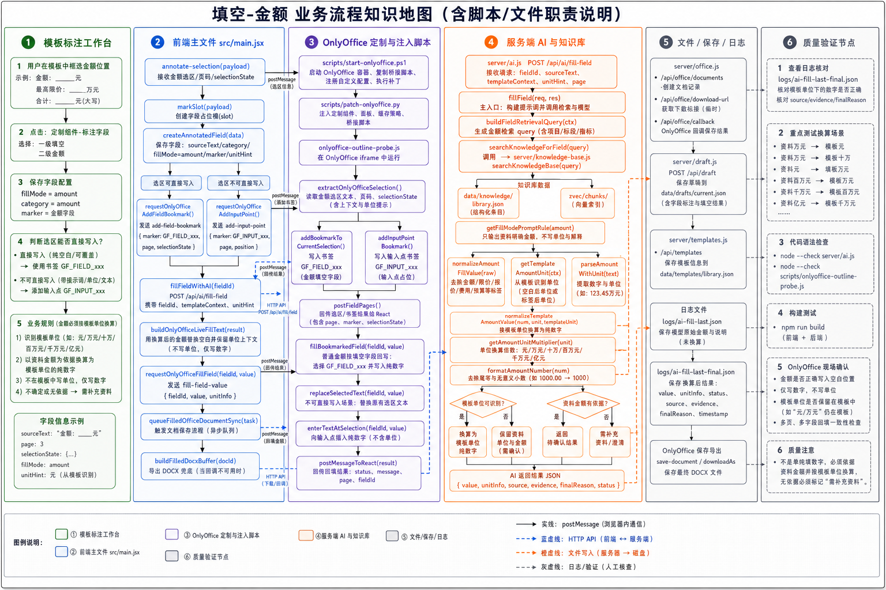

# 填空-金额 业务流程知识地图

流程图：

## 1. 路由与业务定义

| 项 | 内容 |
| --- | --- |
| 一级类别 | 填空 |
| 二级类别 | 金额 |
| 代码值 | `fillMode=amount` |
| 执行原则 | 资料金额必须按模板单位换算。模板可识别单位时输出纯数字；模板未给单位时保留资料金额单位。 |
| 支持单位 | 元、万元、十万、百万元、千万元、亿元等。 |

## 2. 泳道一：模板标注工作台

| 步骤 | 用户动作或业务判断 | 责任说明 |
| --- | --- | --- |
| 1 | 框选金额空白或金额标签 | 例如 `金额： 元`、`最高限价： 万元`、引号内金额空位。 |
| 2 | 点击“标注字段” | 采集真实选区和页码。 |
| 3 | 选择一级“填空”、二级“金额” | 保存 `fillMode=amount`。 |
| 4 | 判断写入范围 | 能识别空白或冒号位置时直接用字段选区，否则添加输入点。 |

## 3. 泳道二：前端主文件 `src/main.jsx`

| 节点 | 代码/接口 | 中文职责说明 |
| --- | --- | --- |
| 类型定义 | `fillModeOptions` | 定义金额二级类型。 |
| 选区接收 | `annotate-selection` 监听 | 接收金额选区、页码、`selectionState`。 |
| 字段创建 | `createAnnotatedField()` | 保存 `sourceText`、`fillMode=amount` 和书签信息。 |
| 写书签 | `requestOnlyOfficeAddFieldBookmark()` | 发送 `add-field-bookmark`。 |
| AI 调用 | `fillFieldWithAI()` | 传入金额选区、模板单位上下文和资料。 |
| 构造写入 | `buildOnlyOfficeLiveFillText()` | 用换算后的金额替换空白，保留模板单位。 |
| 回写 | `requestOnlyOfficeFillField()` | 发送 `fill-field-value` 给 OnlyOffice。 |
| 同步 | `queueFilledOfficeDocumentSync()` | 同步写入后的 DOCX。 |

## 4. 泳道三：OnlyOffice 定制与注入脚本

| 节点 | 脚本/消息 | 中文职责说明 |
| --- | --- | --- |
| 部署 | `scripts/start-onlyoffice.ps1` | 部署 OnlyOffice 和桥接脚本。 |
| 注入 | `scripts/patch-onlyoffice.py` | 注入标注入口并刷新缓存。 |
| 读取选区 | `extractOnlyOfficeSelection()` | 读取金额选区和页码。 |
| 写字段书签 | `addBookmarkToCurrentSelection()` | 写入 `GF_FIELD_xxx`。 |
| 回写入口 | `fillBookmarkedField()` | 普通金额填空按填空字段逻辑回写。 |
| 写入接口 | `replaceSelectedText()` / `enterTextAtSelection()` | 替换字段选区或插入输入点。 |

## 5. 泳道四：服务端 AI 与知识库

| 节点 | 文件/函数 | 中文职责说明 |
| --- | --- | --- |
| AI 接口 | `POST /api/ai/fill-field` | 金额填充接口。 |
| 主入口 | `server/api/routes/ai.routes.js` -> `server/ai/fill.js` / `fillField()` | 构造金额提示词，把模板单位写入规则。 |
| 知识库 | `server/knowledge-base.js` / `searchKnowledgeBase()` | 检索金额依据。 |
| 金额规则 | `getFillModePromptRule("amount")` | 只输出资料明确支持的金额。 |
| 标签清理 | `normalizeAmountFillValue()` | 去除“金额/限价/报价/费用/预算”等字段标签。 |
| 模板单位识别 | `getTemplateAmountUnit()` | 从空白后单位或金额标签后的单位识别目标单位。 |
| 金额解析 | `parseAmountWithUnit()` | 从模型返回或资料文本中提取数字和单位。 |
| 单位换算 | `normalizeTemplateAmountValue()`、`getAmountUnitMultiplier()` | 将资料金额换算成模板单位下的纯数字。 |
| 数字格式 | `formatAmountNumber()` | 去除无意义小数尾零。 |

## 6. 关键条件分支

| 条件 | 是 | 否 |
| --- | --- | --- |
| 模板能识别金额单位 | `normalizeTemplateAmountValue()` 换算成模板单位纯数字。 | 保留资料金额和单位。 |
| 资料金额带单位 | 按资料单位与模板单位换算。 | 只可在证据明确时输出数字，否则需补充资料。 |
| 标注选区可直接写入 | `buildOnlyOfficeLiveFillText()` 替换空白并保留单位。 | 使用输入点写入金额值。 |
| AI 返回金额无依据 | 返回需补充资料。 | 继续回写。 |

## 7. 泳道五：文件、保存、日志

| 节点 | 文件/接口 | 中文职责说明 |
| --- | --- | --- |
| Office 文档 | `server/office.js` / `/api/office/documents` | 初始化 OnlyOffice 文档。 |
| 下载 | `/api/office/download-url` | 下载写入后的 DOCX。 |
| 回调 | `/api/office/callback/:id` | 保存 OnlyOffice 修改结果。 |
| 草稿 | `server/draft.js` / `data/drafts/current.json` | 保存字段和金额填充结果。 |
| 模板 | `server/api/routes/templates.routes.js` -> `server/template-db.js` / `data/templates/library.json` | 保存字段定义。 |
| 原始日志 | `logs/ai-fill-last.json` | 查看模型原始金额输出。 |
| 最终日志 | `logs/ai-fill-last-final.json` | 查看换算后的 `value` 和证据。 |

## 8. 泳道六：质量验证节点

| 验证项 | 命令或检查点 | 验证内容 |
| --- | --- | --- |
| 构建 | `npm run build` | 前端构建。 |
| AI 语法 | `node --check server/api/routes/ai.routes.js` | 金额换算相关语法。 |
| 桥接语法 | `node --check scripts/onlyoffice-outline-probe.js` | 回写脚本语法。 |
| 单位换算 | `logs/ai-fill-last-final.json` | 资料万元、模板元；资料万元、模板十万等场景必须换算正确。 |
| 现场结果 | OnlyOffice 或导出 DOCX | 金额写入空白，模板单位保留。 |

## 9. 当前注意点

- 金额写入不是模型直接操作 Word；模型只产出金额值，前端和 OnlyOffice 桥接负责写入。
- 单位换算要按模板单位，不是单纯抽数字。
