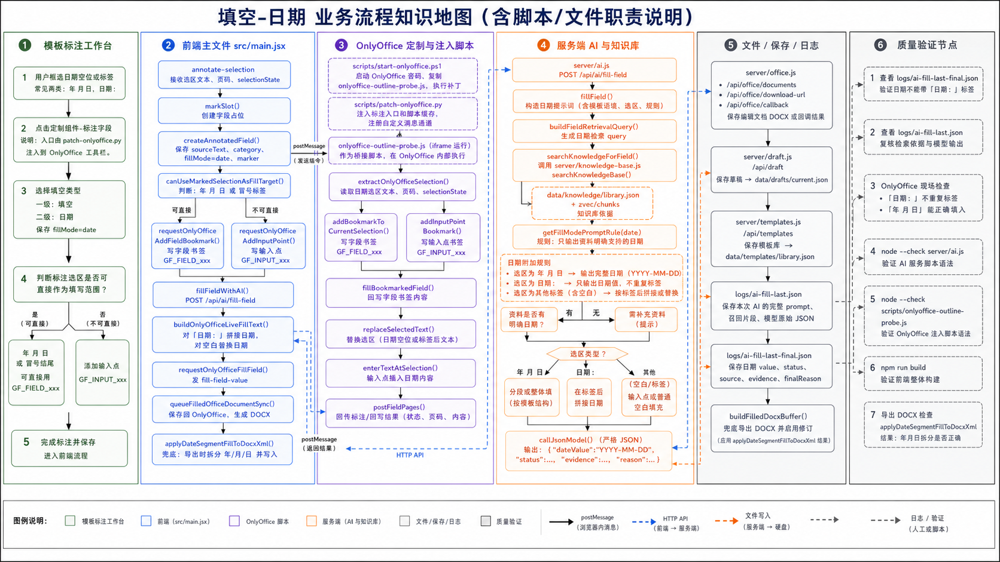

# 填空-日期 业务流程知识地图

流程图：

## 1. 路由与业务定义

| 项 | 内容 |
| --- | --- |
| 一级类别 | 填空 |
| 二级类别 | 日期 |
| 代码值 | `fillMode=date` |
| 常见选区 | `年 月 日` 日期空位；`日期：` 标签。 |
| 执行原则 | AI 只输出资料明确支持的日期值，不重复字段标签，不输出解释。 |

## 2. 泳道一：模板标注工作台

| 步骤 | 用户动作或业务判断 | 责任说明 |
| --- | --- | --- |
| 1 | 框选日期空位或日期标签 | 推荐覆盖 `年 月 日` 或 `日期：`，让系统能判断写入位置。 |
| 2 | 点击“标注字段” | 由定制组件触发 OnlyOffice 选区采集。 |
| 3 | 选择一级“填空”、二级“日期” | 保存 `fillMode=date`。 |
| 4 | 判断是否需要输入点 | `canUseMarkedSelectionAsFillTarget()` 识别 `年 月 日` 或冒号结尾时，不强制输入点。 |

## 3. 泳道二：前端主文件 `src/main.jsx`

| 节点 | 代码/接口 | 中文职责说明 |
| --- | --- | --- |
| 类型定义 | `fillModeOptions` | 定义日期二级类型。 |
| 选区接收 | `annotate-selection` 监听 | 接收日期选区文本、页码和 `selectionState`。 |
| 字段创建 | `markSlot()`、`createAnnotatedField()` | 保存 `fillMode=date`、日期选区和字段书签信息。 |
| 写字段书签 | `requestOnlyOfficeAddFieldBookmark()` | 把日期选区写为 `GF_FIELD_xxx`。 |
| 写入目标判断 | `canUseMarkedSelectionAsFillTarget()` | 判断是否可直接使用标注选区。 |
| 调 AI | `fillFieldWithAI()` | 调 `/api/ai/fill-field` 获取日期值。 |
| 构造写入文本 | `buildOnlyOfficeLiveFillText()` | `日期：` 后拼接日期；空白选区替换空白。 |
| 兜底日期分段 | `applyDateSegmentFillToDocxXml()` | 导出兜底时把日期拆成年、月、日写入 `年 月 日` 空位。 |

## 4. 泳道三：OnlyOffice 定制与注入脚本

| 节点 | 脚本/消息 | 中文职责说明 |
| --- | --- | --- |
| 部署 | `scripts/start-onlyoffice.ps1` | 启动容器并部署桥接脚本。 |
| 注入 | `scripts/patch-onlyoffice.py` | 注入定制组件入口和脚本缓存。 |
| 选区读取 | `extractOnlyOfficeSelection()` | 获取日期选区真实文本和页码。 |
| 书签 | `addBookmarkToCurrentSelection()` | 写入 `GF_FIELD_xxx` 字段书签。 |
| 回写 | `fillBookmarkedField()` | 选择书签并写入日期。 |
| 输入 | `replaceSelectedText()` / `enterTextAtSelection()` | 视写入目标替换选区或插入输入点。 |

## 5. 泳道四：服务端 AI 与知识库

| 节点 | 文件/函数 | 中文职责说明 |
| --- | --- | --- |
| AI 接口 | `POST /api/ai/fill-field` | 日期字段填充接口。 |
| 主入口 | `server/api/routes/ai.routes.js` -> `server/ai/fill.js` / `fillField()` | 构造日期字段提示词并调用模型。 |
| 检索 | `buildFieldRetrievalQuery()` | 根据字段和选区构造日期检索 query。 |
| 知识库 | `searchKnowledgeBase()` | 检索日期依据。 |
| 日期规则 | `getFillModePromptRule("date")` | 要求只输出资料支持的日期。 |
| 日期附加提示 | `fillMode === "date"` 分支 | 明确 `年 月 日` 和 `日期：` 两类模板。 |
| 模型调用 | `callJsonModel()` | 返回严格 JSON。 |

## 6. 关键条件分支

| 条件 | 是 | 否 |
| --- | --- | --- |
| 选区是 `年 月 日` | AI 返回完整日期；现场或兜底导出按日期值填入。 | 继续判断是否为标签。 |
| 选区是 `日期：` | `buildOnlyOfficeLiveFillText()` 在标签后拼接日期值。 | 需要输入点或普通空白匹配。 |
| 资料是否有明确日期 | 返回日期，状态待确认。 | 返回需补充资料。 |
| 导出兜底是否命中分段日期空白 | `applyDateSegmentFillToDocxXml()` 拆分年月日写入。 | 走普通上下文填充或标签填充。 |

## 7. 泳道五：文件、保存、日志

| 节点 | 文件/接口 | 中文职责说明 |
| --- | --- | --- |
| Office 上传 | `server/api/routes/office.routes.js` -> `server/office.js` / `/api/office/documents` | 初始化 OnlyOffice 编辑文档。 |
| 下载 | `/api/office/download-url` | 下载现场 DOCX。 |
| 保存回调 | `/api/office/callback/:id` | 保存 OnlyOffice 修改后的 DOCX。 |
| 草稿 | `server/draft.js` / `data/drafts/current.json` | 保存字段和填充状态。 |
| 模板 | `server/api/routes/templates.routes.js` -> `server/template-db.js` / `data/templates/library.json` | 保存模板字段定义。 |
| 原始日志 | `logs/ai-fill-last.json` | 查看模型输入和日期原始输出。 |
| 最终日志 | `logs/ai-fill-last-final.json` | 查看最终日期、状态和证据。 |

## 8. 泳道六：质量验证节点

| 验证项 | 命令或检查点 | 验证内容 |
| --- | --- | --- |
| 构建 | `npm run build` | 前端构建。 |
| AI 语法 | `node --check server/api/routes/ai.routes.js` | 日期提示词和接口语法。 |
| 桥接语法 | `node --check scripts/onlyoffice-outline-probe.js` | OnlyOffice 回写脚本语法。 |
| 日志 | `logs/ai-fill-last-final.json` | 日期值不能带 `日期：` 标签。 |
| 现场 | OnlyOffice 或导出 DOCX | `日期：` 不重复标签；`年 月 日` 能正确填入。 |

## 9. 当前注意点

- 日期字段不应输出解释性文字。
- 框选区越接近 `年 月 日` 或 `日期：`，写入越稳定。
