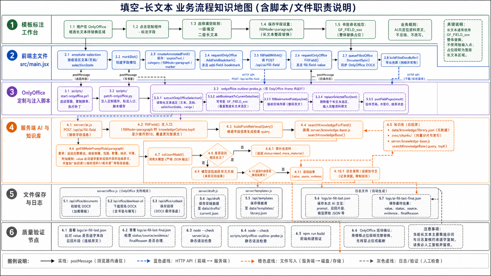

# 填空-长文本 业务流程知识地图

流程图：

## 1. 路由与业务定义

| 项 | 内容 |
| --- | --- |
| 一级类别 | 填空 |
| 二级类别 | 长文本 |
| 代码值 | `fillMode=paragraph` |
| 执行原则 | AI 只定位并复制资料或知识库中的连续原文，不总结、不扩写、不压缩、不语义改写。 |
| 适用场景 | 采购范围、实施内容、服务范围、建设规模、技术要求、商务要求、清单描述等长段落。 |

## 2. 泳道一：模板标注工作台

| 步骤 | 用户动作或业务判断 | 责任说明 |
| --- | --- | --- |
| 1 | 用户在 OnlyOffice 中框选长文本待替换区域 | 选区通常覆盖一整段说明、一个清单块或一组模板占位内容。 |
| 2 | 点击“标注字段” | 由 OnlyOffice 定制组件入口触发选区采集。 |
| 3 | 选择一级“填空”、二级“长文本” | 保存 `fillMode=paragraph`，后续不能再按字段名称硬分流。 |
| 4 | 判断写入目标 | 长文本通常使用字段选区 `GF_FIELD_xxx` 整体替换，不依赖短输入点。 |

## 3. 泳道二：前端主文件 `src/main.jsx`

| 节点 | 代码/接口 | 中文职责说明 |
| --- | --- | --- |
| 类型定义 | `fillModeOptions` | 定义 `paragraph` 为填空二级类型。 |
| 接收选区 | `annotate-selection` 消息监听 | 接收长文本选区、页码、`selectionState`。 |
| 创建字段 | `markSlot()`、`createAnnotatedField()` | 保存 `sourceText`、`fillMode=paragraph`、字段 id、页码和书签信息。 |
| 写字段书签 | `requestOnlyOfficeAddFieldBookmark()` | 向 OnlyOffice 发送 `add-field-bookmark`，固化长文本选区。 |
| 发起填充 | `fillFieldWithAI()` | 调用 `/api/ai/fill-field`，传入长文本字段上下文、资料和知识库配置。 |
| 回写请求 | `requestOnlyOfficeFillField()` | 把 AI 返回的长文本原文发送给 OnlyOffice。 |
| 同步文档 | `queueFilledOfficeDocumentSync()` | 回写后同步现场 DOCX，防止刷新后丢失。 |
| 兜底导出 | `buildFilledDocxBuffer()` | 旧导出兜底链路；现场 OnlyOffice 写入优先。 |

## 4. 泳道三：OnlyOffice 定制与注入脚本

| 节点 | 脚本/消息 | 中文职责说明 |
| --- | --- | --- |
| 容器启动 | `scripts/start-onlyoffice.ps1` | 部署 OnlyOffice、桥接脚本和本地 AI 配置。 |
| 工具栏补丁 | `scripts/patch-onlyoffice.py` | 注入定制组件页签和脚本引用，更新 gzip 缓存。 |
| 选区采集 | `extractOnlyOfficeSelection()` | 读取长文本真实选区和页码，避免靠全文搜索定位。 |
| 书签写入 | `addBookmarkToCurrentSelection()` | 为整个长文本选区写入 `GF_FIELD_xxx`。 |
| 回写入口 | `fillBookmarkedField()` | 接收 `fill-field-value` 后选择字段书签。 |
| 替换执行 | `replaceSelectedText()` | 先删除整个长文本选区，再输入复制的资料原文。 |
| 页码回传 | `postFieldPages()` | 回写后把字段所在页回传给前端。 |

## 5. 泳道四：服务端 AI 与知识库

| 节点 | 文件/函数 | 中文职责说明 |
| --- | --- | --- |
| AI 接口 | `POST /api/ai/fill-field` | 长文本字段统一走该接口。 |
| 主入口 | `server/ai.js` / `fillField()` | 组装字段上下文、知识库片段、上传资料并调用模型。 |
| 召回加量 | `fillField()` 中 `paragraph topK>=10` | 长文本把知识库 `topK` 提升到至少 `10`，提高完整段落命中概率。 |
| 查询构造 | `buildFieldRetrievalQuery()` | 结合字段名、选区、说明生成检索 query。 |
| 知识库检索 | `searchKnowledgeBase()` | 从 `data/knowledge/library.json` 和 `data/knowledge/zvec/chunks` 检索长段落依据。 |
| 长文本规则 | `getFillModePromptRule("paragraph")` | 要求保留建设规模、范围边界、数量、地点、对象等关键信息。 |
| 复制约束 | `paragraph` 附加提示 | 要求 `value` 必须逐字复制召回片段中的连续原文，不复制包装前缀。 |
| 模型调用 | `callJsonModel()` | 要求模型返回严格 JSON。 |

## 6. 关键条件分支

| 条件 | 是 | 否 |
| --- | --- | --- |
| 知识库或资料是否召回相关长文 | 模型基于召回片段定位连续原文。 | 返回需补充资料，不应编写或套模板。 |
| 模型返回是否为资料连续原文 | 当前主要靠 prompt 和日志人工复核。 | 发现改写时应回看 `ai-fill-last.json` 并优化守卫。 |
| 回写目标是否为字段书签 | 使用 `replaceSelectedText()` 整体替换选区。 | 长文本一般不走输入点；若走输入点只插入原文。 |

## 7. 泳道五：文件、保存、日志

| 节点 | 文件/接口 | 中文职责说明 |
| --- | --- | --- |
| Office 文档上传 | `server/office.js` / `/api/office/documents` | 把模板 DOCX 交给 OnlyOffice 编辑。 |
| DOCX 下载 | `/api/office/download-url` | 下载 OnlyOffice 现场导出的 DOCX。 |
| 保存回调 | `/api/office/callback/:id` | 接收 OnlyOffice 保存后的文件。 |
| 草稿 | `server/draft.js` / `data/drafts/current.json` | 保存字段、资料、知识库选择和填充状态。 |
| 模板字段 | `server/templates.js` / `data/templates/library.json` | 持久化模板字段定义。 |
| 原始日志 | `logs/ai-fill-last.json` | 用于核对长文本是否来自召回原文。 |
| 最终日志 | `logs/ai-fill-last-final.json` | 用于查看最终 `value/status/source/evidence/finalReason`。 |

## 8. 泳道六：质量验证节点

| 验证项 | 命令或检查点 | 验证内容 |
| --- | --- | --- |
| 构建 | `npm run build` | 验证前端构建。 |
| AI 语法 | `node --check server/ai.js` | 验证长文本提示词和接口语法。 |
| 桥接语法 | `node --check scripts/onlyoffice-outline-probe.js` | 验证替换选区脚本语法。 |
| 原文一致性 | 比对 `logs/ai-fill-last.json` 的召回片段与 `value` | 确认长文本未被总结或改写。 |
| 现场结果 | OnlyOffice 文档 | 确认模板原占位段落被完整替换。 |

## 9. 当前注意点

- 当前长文本没有像 `choice-replace` 那样的强制逐字复制守卫，日志复核很重要。
- 不能把模板长段占位当资料来源。
