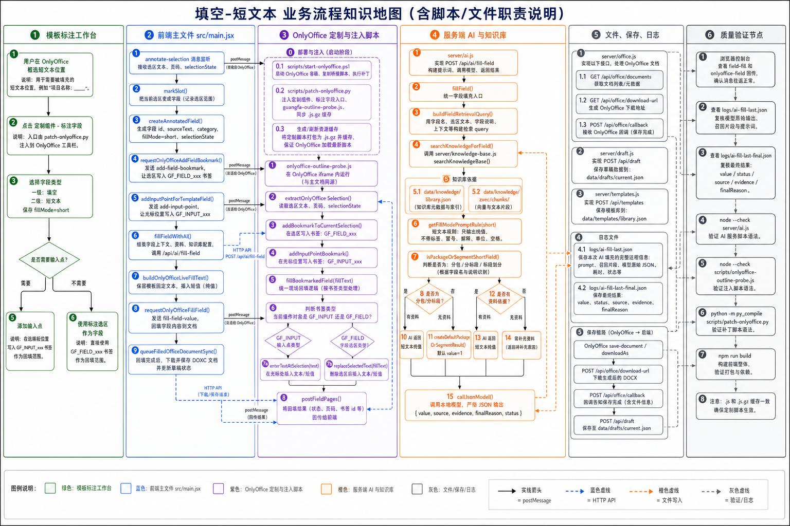

# 填空-短文本 业务流程知识地图

流程图：

## 1. 路由与业务定义

| 项 | 内容 |
| --- | --- |
| 一级类别 | 填空 |
| 二级类别 | 短文本 |
| 代码值 | `fillMode=short` |
| 执行原则 | 只写入短值，不改写模板固定文本。模板选区只用于判断写入位置，不作为答案来源。 |
| 当前约束 | 普通短文本必须走 `/api/ai/fill-field` 的模型 JSON 输出；不得在模型调用前用“项目名称/地点”等正则捷径直接返回结果。 |
| 当前特例 | 选区或字段上下文为分包、分标段、标段划分时，资料有对应值按资料填写；资料无明确值时默认填写 `1`。 |

## 2. 泳道一：模板标注工作台

| 步骤 | 用户动作或业务判断 | 责任说明 |
| --- | --- | --- |
| 1 | 用户在 OnlyOffice 中框选短文本位置 | 选区应覆盖要填写的短文本位置，例如冒号后空白、引号内空白、下划线空位。 |
| 2 | 点击定制组件中的“标注字段” | 入口由 `scripts/patch-onlyoffice.py` 注入到 OnlyOffice 工具栏。 |
| 3 | 选择一级类别“填空”、二级类别“短文本” | 前端保存 `category=填空`、`fillMode=short`，后续 AI 和回写都按该二级类型执行。 |
| 4 | 判断是否需要输入点 | `src/main.jsx` 的 `canUseMarkedSelectionAsFillTarget()` 会判断标注选区能否直接作为填写范围；不能直接写时再要求添加输入点。 |
| 5 | 可选：添加输入点 | `addInputPointForTemplateField()` 发送 `add-input-point`，OnlyOffice 写入 `GF_INPUT_xxx`。 |

## 3. 泳道二：前端主文件 `src/main.jsx`

| 节点 | 代码/接口 | 中文职责说明 |
| --- | --- | --- |
| 字段类型定义 | `fillModeOptions` | 定义 `short`、`paragraph`、`date`、`amount`、`choice`、`choice-replace`、`amount-choice` 七个二级类型。 |
| 接收选区 | `annotate-selection` 消息监听 | 接收 OnlyOffice 回传的选区文本、页码、`selectionState`。 |
| 创建字段 | `markSlot()`、`createAnnotatedField()` | 生成字段 id，保存 `sourceText`、`category`、`fillMode=short`、页码和书签标记。 |
| 写字段书签 | `requestOnlyOfficeAddFieldBookmark()` | 发送 `postMessage: add-field-bookmark`，要求 OnlyOffice 给当前选区写入 `GF_FIELD_xxx`。 |
| 写输入点书签 | `requestOnlyOfficeAddInputPoint()` | 发送 `postMessage: add-input-point`，要求 OnlyOffice 给光标位置写入 `GF_INPUT_xxx`。 |
| 发起 AI 填充 | `fillFieldWithAI()` | 合并模板字段和填充字段，携带 `sourceText`、`fillMode`、`writeMode`、资料和知识库配置调用 `/api/ai/fill-field`。 |
| 生成现场写入文本 | `buildOnlyOfficeLiveFillText()` | 将短值写入空白、冒号后、引号内等位置，保留模板固定前后缀。 |
| 发送回写 | `requestOnlyOfficeFillField()` | 发送 `postMessage: fill-field-value`，把 `value`、`fillText`、书签名和 `fillMode` 发给 OnlyOffice。 |
| 同步 DOCX | `queueFilledOfficeDocumentSync()` | 回写后调用 OnlyOffice `downloadAs("docx")` 或保存回调，把现场修改后的 DOCX 同步到前端状态。 |

## 4. 泳道三：OnlyOffice 定制与注入脚本

| 节点 | 脚本/消息 | 中文职责说明 |
| --- | --- | --- |
| 启动部署 | `scripts/start-onlyoffice.ps1` | 启动或复用 `guangfa-onlyoffice` 容器，复制桥接脚本，执行补丁脚本，写入本地 AI 配置。 |
| 注入入口 | `scripts/patch-onlyoffice.py` | 注入“定制组件”和“标注字段”按钮；挂载 `guangfa-outline-probe.js`；重写 `.js.gz` 与缓存号。 |
| 读取选区 | `scripts/onlyoffice-outline-probe.js` / `extractOnlyOfficeSelection()` | 在 OnlyOffice iframe 内读取真实选区文本、页码、`selectionState`。 |
| 回传选区 | `postMessage: annotate-selection` | OnlyOffice → React，传回选区信息。 |
| 写字段书签 | `addBookmarkToCurrentSelection()` | 恢复 `selectionState`，写入 `GF_FIELD_xxx`，并触发 `saveOnlyOfficeDocument("field-bookmark")`。 |
| 写输入点 | `addInputPointBookmark()` | 在当前光标位置写入 `GF_INPUT_xxx`，用于不能直接用选区写入的短文本。 |
| 现场回写 | `fillBookmarkedField()` | 接收 `fill-field-value` 后选择书签。`GF_FIELD_xxx` 走替换选区，`GF_INPUT_xxx` 走插入输入点。 |
| 写入接口 | `replaceSelectedText()`、`enterTextAtSelection()` | 前者先删除字段选区再输入；后者在光标或输入点插入短值。 |

## 5. 泳道四：服务端 AI 与知识库

| 节点 | 文件/函数 | 中文职责说明 |
| --- | --- | --- |
| AI 接口 | `POST /api/ai/fill-field` | 短文本 AI 填充接口，由前端 `fillFieldWithAI()` 调用。 |
| 主入口 | `server/api/routes/ai.routes.js` -> `server/ai/fill.js` / `fillField()` | 归一化 `fillMode`，构造检索 query，组合知识库片段和上传资料，调用模型。 |
| 检索 query | `buildFieldRetrievalQuery()` | 根据字段名、选区原文、字段说明生成检索关键词。 |
| 知识库检索 | `searchKnowledgeForField()` → `server/knowledge-base.js` / `searchKnowledgeBase()` | 从项目知识库和全局知识库召回相关原始切片；召回阶段不做 AI 改写、不替用户判断最终复制范围。 |
| 知识库文件 | `data/knowledge/library.json`、`data/knowledge/zvec/chunks` | 存储知识库元数据、文本切片和向量索引。 |
| 系统溯源 | `buildFillSourceCitation()`、`applySystemCitation()` | 从知识库/临时资料召回结果中选取相关度最高的 1 个片段，生成固定 `source` 与 `sourceSnippetText`；不使用 AI 的证据总结做前端溯源。 |
| 短文本提示词 | `getFillModePromptRule("short")` | 要求只输出纯值，不带标签、冒号、序号、句号或解释。 |
| 禁止前置捷径 | `fillField()` 模型调用前 | 普通短文本不得用项目名称、工程地点、地址等正则分支直接返回；这些字段也必须由 AI 依据召回片段输出 JSON。 |
| 分包判断 | `isPackageOrSegmentShortField()` | 只在 `fillMode=short` 且上下文含分包、分标段、标段划分时启用默认规则。 |
| 默认值 | `createDefaultPackageOrSegmentResult()` | 未检索到明确分包/分标段值时返回 `value="1"`。 |
| 模型调用 | `callJsonModel()` | 调本地 OpenAI 兼容模型，要求严格 JSON 输出。 |

## 6. 关键条件分支

| 条件 | 是 | 否 |
| --- | --- | --- |
| 标注选区能否直接作为填写范围 | 使用 `GF_FIELD_xxx`，由 `replaceSelectedText(fillText)` 替换空白或选区。 | 要求添加输入点，使用 `GF_INPUT_xxx` 插入短值。 |
| 是否为分包/分标段/标段划分短文本 | 检查资料是否有对应值；无值时默认 `1`。 | 按普通短文本规则，只输出资料支持的纯值。 |
| 是否检索到资料或知识库片段 | 调模型生成短值，并做最终日志记录；项目名称、工程名称、地点、地址等也走该路径。 | 普通短文本返回需补充资料；分包/分标段特例返回 `1`。 |
| 模型返回是否只包含目标短值 | 进入后置结果，供前端回写。 | 后置校验拦截模板原文依据、空值或资料不足结果，写入 `logs/ai-fill-last-final.json`。 |
| 溯源是否展示 AI 总结 | 不展示；前端只显示系统生成的最高相关来源行。 | 点击“展开”查看该片段原文，AI 的 `modelParsed.evidence` 仅留在日志中。 |
| OnlyOffice 回写目标是 `GF_INPUT` 还是 `GF_FIELD` | `GF_INPUT`：`enterTextAtSelection()` 插入。 | `GF_FIELD`：`replaceSelectedText()` 删除选区后输入。 |

## 7. 泳道五：文件、保存、日志

| 节点 | 文件/接口 | 中文职责说明 |
| --- | --- | --- |
| Office 文档接口 | `server/api/routes/office.routes.js` -> `server/office.js` / `/api/office/documents` | 上传 DOCX 给 OnlyOffice，返回编辑器配置。 |
| Office 下载 | `server/api/routes/office.routes.js` -> `server/office.js` / `/api/office/download-url` | 代理下载 OnlyOffice `downloadAs` 产生的 DOCX。 |
| Office 回调 | `server/api/routes/office.routes.js` -> `server/office.js` / `/api/office/callback/:id` | OnlyOffice 保存时把最新 DOCX 写回服务端临时目录。 |
| 草稿保存 | `server/draft.js` / `/api/draft` | 保存当前模板、字段、资料、知识库选择和填充结果到 `data/drafts/current.json`。 |
| 模板库 | `server/api/routes/templates.routes.js` / `/api/templates` | 保存模板字段定义到 `data/templates/library.json`。 |
| 模型原始日志 | `logs/ai-fill-last.json` | 保存 prompt、召回片段、模型原始 JSON 和解析结果。 |
| 最终结果日志 | `logs/ai-fill-last-final.json` | 保存业务守卫后的结果、`status`、系统 `source/sourceSnippetText`、`finalReason`；`modelParsed.evidence` 只用于排查模型判断。 |

## 8. 泳道六：质量验证节点

| 验证项 | 命令或检查点 | 验证内容 |
| --- | --- | --- |
| 前端构建 | `npm run build` | 验证主前端和打包链路。 |
| AI 服务语法 | `node --check server/api/routes/ai.routes.js` | 验证 AI 路由、提示词和守卫代码语法。 |
| OnlyOffice 桥接语法 | `node --check scripts/onlyoffice-outline-probe.js` | 验证选区、书签、输入、回写脚本语法。 |
| 日志复核 | 查看 `logs/ai-fill-last.json` | 确认模型输入、召回片段和原始输出。 |
| 最终复核 | 查看 `logs/ai-fill-last-final.json` | 确认 `value/status/source/sourceSnippetText/finalReason`，并确认有 `modelParsed`，证明填充值经过 AI 判断而不是前置规则直出。 |
| 短文本冒烟 | 调 `/api/ai/fill-field`，字段设为 `项目名称：` | 应返回纯项目名，例如只返回“中共四川省委组织部内网综合办公平台建设项目”，不能带“竞争性磋商文件、采购人、目录、TOC”等后续正文。 |
| 溯源冒烟 | 查看填充卡片的“溯源”区域 | 默认只显示 `知识库1（项目库｜文件名 片段X）` 这一行；展开后显示片段原文，不显示 AI 生成的解释句。 |
| 现场验证 | 浏览器控制台 `field-fill` 结果 | 确认 OnlyOffice 回写返回 ok，且短文本写入目标正确。 |

## 9. 当前注意点

- 短文本默认 `1` 只适用于分包、分标段、标段划分，不应扩散到普通短文本。
- 模板选区原文不能作为答案来源。
- 召回片段只是资料候选，不是最终填充值；普通短文本的复制/截取范围必须由 AI 在 `/api/ai/fill-field` 模型调用中判断。
- 溯源展示只保留系统最高相关片段；不要把 AI 的 `evidence` 总结展示到前端卡片。
- 不要再为“项目名称/地点/地址”等普通短文本加模型前置正则捷径，否则会绕过 AI，并可能把目录、采购人、TOC 等连续文本截入 value。
- 调试 OnlyOffice 注入脚本后，必须确认容器内 `.js` 与 `.js.gz` 都已更新，否则页面可能继续跑旧逻辑。

## 10. 修订记录

| 日期 | 修订内容 |
| --- | --- |
| 2026-07-02 | 删除普通短文本“项目名称/地点”模型前置正则捷径后的流程同步：召回只提供原始切片，短文本统一走 AI JSON 判断，日志需确认 `modelParsed`。 |
| 2026-07-02 | 严格溯源同步：前端溯源只显示系统最高相关片段来源，展开查看片段原文，不展示 AI 证据总结。 |
